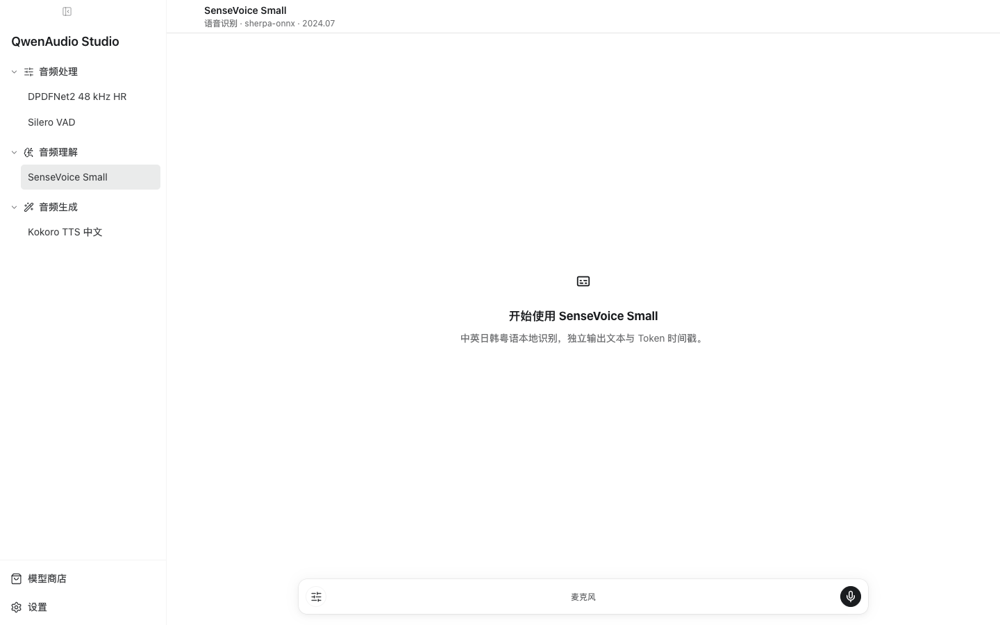

# QwenAudio Toolkits

[中文](README_ZH.md) | [English](README.md)

[](https://github.com/QwenAudio/qwen-audio-toolkits/actions/workflows/ci.yml)
[](LICENSE)
[](https://v2.tauri.app/)
[](docs/getting-started.md)

QwenAudio Toolkits is a local-first desktop workspace for audio AI models.
Install a model, then upload, record, or monitor audio through a conversation-like
interface. Results can be played immediately and inspected as waveforms, Mel
spectrograms, timestamps, speaker segments, and runtime metadata.

The application connects local runtimes and cloud APIs through one typed
**Harness capability contract**. Model weights are downloaded on demand rather
than bundled with the app.

> The current public preview targets Apple Silicon on macOS 14.2 or later.
> Windows and Linux are considered in the architecture but are not yet
> production-ready.



## Highlights

- Audio processing: VAD, enhancement, denoising, source separation, live audio
- Audio understanding: ASR, language ID, keyword spotting, audio tagging,
  speaker embeddings, and diarization
- Audio generation: multi-speaker TTS, streaming synthesis, and voice cloning
- Text processing: punctuation restoration and TN / ITN normalization
- Shared input, streaming, preview, and result-detail components across models
- Remote catalog with on-demand installs, variants, checksums, and dependencies
- Local runtimes including sherpa-onnx, FunASR llama.cpp, CosyVoice.cpp,
  DeepFilterNet, RNNoise, and kaldifst, plus Alibaba Cloud Model Studio APIs

Dependency models stay out of the main workspace unless explicitly added.
Shared weights are physically deleted only after their final reference is gone.

## Install

Prebuilt Apple Silicon packages are available on
[GitHub Releases](https://github.com/QwenAudio/qwen-audio-toolkits/releases).
Choose the latest release, download its `.dmg` asset, open it, and drag the app
into Applications. Model weights and runtime packages are still downloaded on
demand from [ModelScope](https://www.modelscope.cn/models/funaudio_public/QwenAudio-Toolkits).

The current builds are not Apple-notarized. If macOS blocks the first launch,
review and allow it under **System Settings → Privacy & Security**. Only install
packages from the project release location.

To run from source, install Node.js 20.19+, Rust 1.77.2+, CMake, the
[Tauri 2 prerequisites](https://v2.tauri.app/start/prerequisites/), and Xcode
Command Line Tools on macOS:

```bash
git clone https://github.com/QwenAudio/qwen-audio-toolkits.git
cd qwen-audio-toolkits
npm ci
npm run desktop:dev
```

`npm run dev` starts a browser-only UI preview. Native inference, microphones,
system audio, and updates require the Tauri desktop process. See the
[getting-started guide](docs/getting-started.md) for details. Maintainers can
follow the [release guide](docs/releasing.md) to publish signed updates.

## Models, Data, and Privacy

Local model assets are downloaded only after installation and local inference
does not upload audio. Choosing a cloud API model sends the requested input to
that provider; the UI labels local and cloud models explicitly. Model weights,
datasets, and hosted services retain their original licenses and terms.

The app contains no built-in telemetry, advertising analytics, or automatic
crash reporting. See [PRIVACY.md](PRIVACY.md) for storage, credentials, and
network boundaries.

## Architecture

```text
React / TypeScript workspace
            │ Tauri commands + events
            ▼
Rust Harness runtime ─── local HTTP API (127.0.0.1:3847)
            │
            ├── reviewed local adapters ── on-demand model assets
            └── configured cloud providers
```

The Harness exposes a finite set of capabilities, ports, and parameter types.
Plugins cannot inject arbitrary native code into the main process. New runtime
architectures require a reviewed adapter; compatible models then reuse it with
declarative manifests.

- [Architecture](docs/architecture.md)
- [Model catalog](docs/model-catalog.md)
- [Model Plugin v2](docs/model-plugin-v2.md)
- [Plugin JSON Schema](docs/plugin-manifest.schema.json)

## Development

```bash
npm run lint
npm test
npm run build
cargo fmt --manifest-path src-tauri/Cargo.toml --check
cargo test --manifest-path src-tauri/Cargo.toml
node scripts/workflow-smoke.mjs
# Requires a running local Harness; unavailable optional local dependencies are skipped.
npm run workflow:smoke
```

See [CONTRIBUTING.md](CONTRIBUTING.md) before a substantial change. Report
security issues privately according to [SECURITY.md](SECURITY.md).

## License

Original project source is licensed under the
[Apache License 2.0](LICENSE). Third-party runtimes, libraries, and models keep
their own licenses; see [NOTICE](NOTICE) and
[THIRD_PARTY_NOTICES.md](THIRD_PARTY_NOTICES.md).
