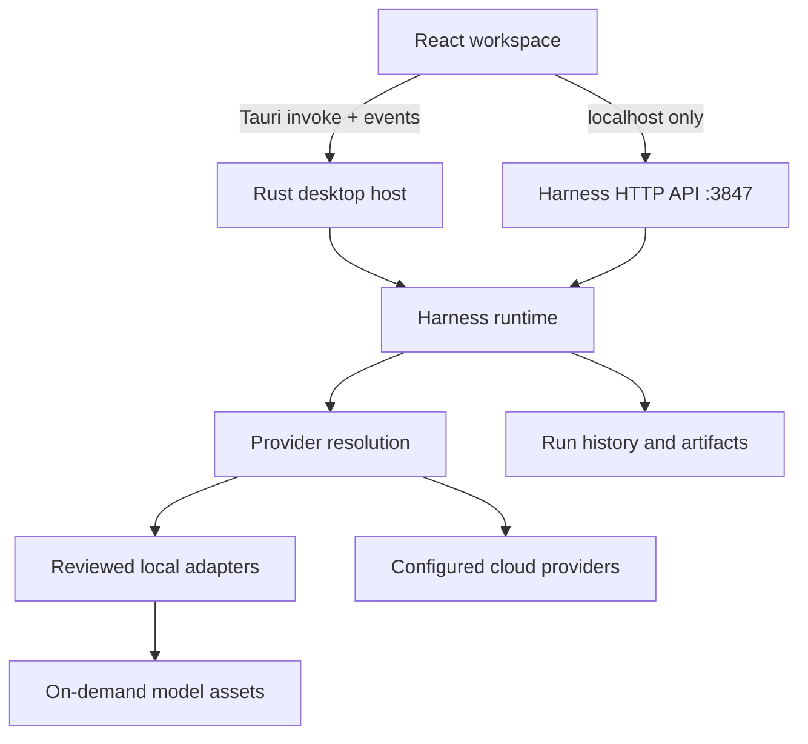

# Architecture

QwenAudio Toolkits separates presentation, task orchestration, model metadata,
and inference runtimes. The frontend does not contain per-model execution
logic; models enter the same Harness contract.

## Frontend

The React frontend lives in `src/`:

- `App.tsx` owns the desktop shell, model navigation, settings, and global run
  state.
- `views/ModelWorkspaceView.tsx` renders the conversation and capability-aware
  input controls.
- `views/PluginsView.tsx` renders the model catalog, installation state, model
  variants, and dependency bindings.
- `components/` contains shared waveform, spectrogram, recording, drop-zone,
  and playback controls.
- `services/harness.ts` is the typed boundary for frontend-to-Rust calls.
- `domain/capabilities.ts` and `domain/results.ts` normalize capability metadata
  and output presentation.

Some workflow code remains in the repository but the workflow UI is currently
feature-gated while its interaction model is redesigned.

## Harness runtime

`src-tauri/src/harness.rs` owns run creation, status transitions, provider
resolution, artifacts, and streaming sessions. A run declares:

- one capability such as `speech.transcribe` or `audio.enhance`;
- a provider and model;
- typed input and parameters;
- whether the run is visible in the parent conversation;
- optional dependency run IDs.

Dependency runs do not create duplicate conversations. Their output is attached
to the parent result detail. Model bindings are persisted by the Rust backend,
so sidebar removal, store removal, and the local API share the same reference
graph. Referenced weights are retained; unreferenced weights are deleted.

## Model plugins

A plugin manifest describes presentation metadata, a reviewed adapter, model
assets, capabilities, typed ports, parameters, variants, and optional model
dependencies. Installation follows a staging process:

1. Validate the manifest and adapter.
2. Download declared assets into a staging directory.
3. Verify checksums when supplied.
4. Extract archives with path traversal and size limits.
5. Validate required files.
6. Atomically move the completed plugin into the application data directory.

Plugins cannot load arbitrary native libraries. `src-tauri/src/plugins.rs`
contains the adapter allowlist and validation rules. See
[Model Plugin v2](model-plugin-v2.md).

## Streaming

Streaming adapters use explicit start, push, event, and finish phases. This
keeps live ASR, TTS, VAD, and enhancement independent from batch runs while
preserving the same final result schema. UI playback consumes incremental audio
only once and uses the finalized artifact for history.

## Local API and trust boundary

The app exposes an experimental HTTP API on `127.0.0.1:3847` for local
integration and smoke tests. It is not authenticated and must not be bound or
proxied to a LAN or public interface. Tauri asset scopes are restricted to
application-owned audio directories.

Cloud provider credentials are stored in the private application configuration
directory. Native credential-vault integration is planned. See
[PRIVACY.md](../PRIVACY.md) and [SECURITY.md](../SECURITY.md).

