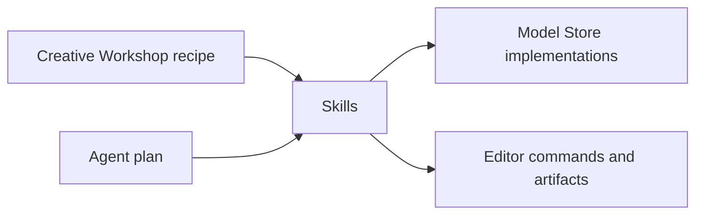

# Creative Workshop and Skills design

## Purpose

QwenAudio Toolkits has two complementary ways to begin work:

- **Creative Workshop** helps a person complete a known, high-frequency audio
  or video task through a fixed, guided flow.
- **Agent chat** helps a person describe an unfamiliar or open-ended goal in
  natural language.

Neither entry point should force users to understand models, prompts, or Skill
packages before they can start. **Skills** sit beneath both entry points as the
reusable capability layer.

## Product boundary

| Layer | Primary user question | Responsibility |
| --- | --- | --- |
| Creative Workshop | "What do I want to make?" | Present task recipes, collect fixed inputs and choices, start a dedicated workspace. |
| Agent | "How should this unusual request be done?" | Interpret intent, select capabilities, plan work, and request approval where needed. |
| Skill | "What can the system do?" | Declare a reusable capability, how to invoke it, and what it requires. |
| Model Store | "What implementation runs it?" | Install and configure local or cloud model implementations. |

Creative Workshop is therefore not a second Skills catalog. It is the product's
primary task entry point. Skills is an advanced capability and extension
surface; its catalog supports installation, configuration, inspection, version
management, and eventually custom authoring or sharing.

## Creative Workshop workflows

A workflow is a versioned task recipe with a small, deterministic launch form.
It owns the user-facing name, category, source requirements, fixed options,
and the editor to open. It must be usable without configuring an Agent model.

The first workflows are grouped by output medium:

- **Video**: Smart Cut, Captioned Video, Video Dubbing.
- **Audio**: AI Podcast, Meeting Notes.

Workflow steps can still require models. For example, Smart Cut needs ASR and
may use VAD; AI Podcast needs a text-generation and TTS model. The workflow
checks only the models needed by the requested step and offers installation or
configuration in context. It never turns a missing Agent key into a blocker for
the whole workflow.

The current application stores a workshop launch as an editor-only task so it
appears in recent tasks and persists with normal project data, but it does not
display an Agent conversation. Existing workspace-agent catalog entries are a
temporary bridge, not the desired one-to-one relationship.

## Skills

A Skill is a declarative, installable package inspired by modern LLM Skill
systems. It is not a whole product feature by default. A Skill should describe
its scope, trigger guidance, instructions, typed inputs and outputs, tool
bindings, model requirements, and permission needs.

Illustrative target shape:

```ts
type SkillManifest = {
  id: string
  name: string
  version: string
  description: string
  instructions: string
  triggers?: string[]
  inputs: InputSchema[]
  outputs: OutputSchema[]
  tools: ToolBinding[]
  modelRequirements?: ModelRequirement[]
  permissions?: Permission[]
}
```

Examples of composable Skills:

- `transcribe-video`: extract a timestamped dialogue transcript from video.
- `remove-filler-words`: produce reviewable edit ranges from word timestamps.
- `translate-dialogue`: translate and localize dialogue segments.
- `synthesize-dialogue`: render speaker- and style-aware dialogue audio.
- `extract-action-items`: derive decisions, action items, and owners from a
  meeting transcript.

A Skill package must not gain arbitrary code execution merely by being
installed. The host remains responsible for allowlisted tools, typed contracts,
model resolution, permission prompts, and project-state transactions.

## Composition

Both top-level experiences use the same Skills:



For example, **Video Dubbing** can compose transcript extraction, dialogue
translation, voice synthesis, timing alignment, subtitle rendering, and final
video rendering. An Agent can use that same set for a request such as "make a
shorter Japanese version and retain the original product names," while the
workshop exposes only the stable, high-frequency choices.

## Migration

1. Keep existing workspace workflows available through Creative Workshop.
2. Preserve the current reviewed `agent.json` project contract for imported
   model-backed projects.
3. Introduce a separate Skill manifest and registry for declarative capability
   metadata, without changing the host security boundary.
4. Make workflows reference one or more Skills rather than a single workspace
   skill.
5. Let Agent planning discover the same registered Skills and compose them into
   reviewable project operations.

This migration deliberately avoids redefining a model adapter as an autonomous
Agent or allowing third-party packages to execute arbitrary code.
