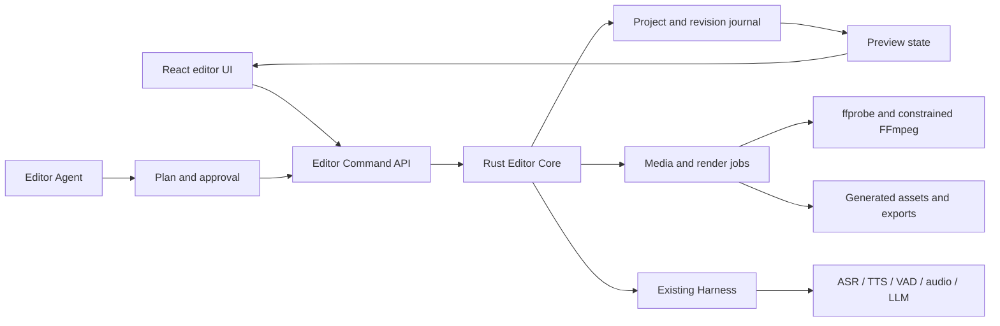

# Dubbing and Video Editor Agent Design

Status: discussion draft

This document proposes an audio-first, agent-native editing workspace for
QwenAudio Toolkits. It is intentionally narrower than a general-purpose video
editor: the first product should make dubbing, transcript editing, captions,
audio repair, and talking-head editing unusually good before expanding into a
complete nonlinear editor.

## Product thesis

QwenAudio Toolkits should not begin by cloning every CapCut feature. Its useful
advantage is the set of audio capabilities it already owns behind one Harness:

- timestamped ASR and streaming ASR;
- TTS and reference-voice workflows;
- voice activity detection and silence analysis;
- enhancement, separation, and loudness normalization;
- speaker diarization and speaker embeddings;
- LLM providers and declarative model configuration;
- waveform, spectrogram, caption, and audio result views.

The proposed product is therefore an **audio-first, Agent-driven audio and
video creation IDE**. The Agent understands user intent, plans workflows,
orchestrates models, and produces reviewable edits; dedicated editing surfaces
provide timeline, waveform, caption, dubbing, and preview controls; the model
store supplies local and cloud capabilities on demand.

This goal is organized around three product pillars:

1. **Conversational Agent workflow**: the user describes an audio or video goal
   in natural language, then the Agent plans the workflow, chooses tools and
   models, runs long tasks, and returns reviewable edits instead of opaque
   results.
2. **On-demand open source model store**: open-source local models, runtime packages,
   dependencies, and cloud model definitions are installed only when a skill or
   project needs them.
3. **Dedicated professional editing surfaces**: timeline, waveform, transcript,
   caption, dubbing, and preview interfaces provide precise manual control,
   while the Agent operates the same project state.

In this product, a human can edit precisely and an Agent can operate the same
project through a small, deterministic, reversible command API.

The initial promise is:

> Import a video, understand its speech, rewrite or translate the script,
> generate and align voiceover, repair the mix, create captions, make simple
> editorial changes, preview the result, and export a reproducible video.

## Lessons from existing projects

The following projects are useful references, but none should be copied as a
complete foundation.

### OpenCut

[OpenCut](https://github.com/OpenCut-app/OpenCut) is the closest interaction
reference to a modern CapCut-style editor. Its current rewrite identifies the
right long-term boundaries: a Rust core, Editor API, first-class plugins, MCP,
headless operation, and scripting. Most of those boundaries are still under
development, so OpenCut should be treated as a design reference rather than a
ready-made engine.

The archived
[OpenCut Classic](https://github.com/OpenCut-app/opencut-classic) has one
particularly useful pattern: timeline mutations are commands with explicit
`execute`, `undo`, and `redo` behavior. Multiple commands can be grouped into a
single reversible batch. This is the right foundation for both human editing
and Agent editing.

### Kdenlive and MLT

[Kdenlive](https://github.com/KDE/kdenlive) demonstrates mature nonlinear
editing behavior on top of the [MLT framework](https://www.mltframework.org/):
tracks, playlists, producers, filters, transitions, proxy media, preview
scaling, serialization, and headless rendering. These concepts are valuable,
but adopting Kdenlive code is not compatible with this Apache-2.0 codebase and
embedding MLT would add a large native and distribution surface.

### LosslessCut

[LosslessCut](https://github.com/mifi/lossless-cut) is a useful reference for
ffprobe metadata, constrained FFmpeg execution, fast stream-copy operations,
segment handling, and export failure reporting. It is GPL-2.0, so its code
should be studied rather than copied.

### OpenTimelineIO

[OpenTimelineIO](https://github.com/AcademySoftwareFoundation/OpenTimelineIO)
provides the strongest reference for the project domain model:

- a timeline contains a stack of tracks;
- tracks contain clips, gaps, transitions, and nested structures;
- media is referenced rather than embedded;
- source ranges are distinct from timeline ranges;
- time is represented as a value plus a rational rate;
- adapters translate between the canonical timeline and external formats.

QwenAudio Toolkits does not need to embed the Python/C++ implementation in its
first version, but its project schema should remain conceptually compatible
with this model so that a future OTIO adapter is straightforward.

### Remotion

[Remotion](https://github.com/remotion-dev/remotion) is excellent for scripted
motion graphics and template-driven video generation. It should be an optional
future renderer, not the core editor: its current license requires a company
license in some commercial organizations and restricts redistribution of
derivative products.

## Broader AI creation opportunity

The long-term product is larger than captioning or video editing. It can be an
AI audio-visual creation workspace in which text, audio, video, presentations,
and reusable media become editable projects and deliverables.

All creation modes should share the same underlying objects:

- scripts and dialogue segments;
- speakers, voices, and generated takes;
- immutable media assets and derived assets;
- sequences, tracks, clips, captions, and project variants;
- model runs, render jobs, revision history, and approvals.

This avoids building a separate mini-application for every new creation mode.

### Creation modes

| Mode | Typical input | Main output | Fit with the current product |
| --- | --- | --- | --- |
| Video captioning | Video or audio | Editable burned-in or sidecar captions | Very high |
| Video editing | Video and audio assets | Edited video project and export | Medium |
| Text voiceover | Script or article | Segmented, editable speech project | Very high |
| Video localization | Video plus target languages | Translated dialogue, voiceover, captions, and localized video | High |
| AI podcast | Topic, outline, sources, or recording | Scripted or edited podcast and audiogram | High |
| Audiobook and audio drama | Novel, article, or screenplay | Narration, multi-character dialogue, ambience, and mastered audio | Very high |
| Talking-head generation | Article, outline, presentation, or URL | Script, narration, captions, supporting media, and finished video | High |
| Long-form repurposing | Interview, course, livestream, or podcast | Chapters, highlights, and multiple short videos | High |
| Dialogue replacement / ADR | Existing video and corrected lines | Voice-matched replacement dialogue and repaired mix | Very high |
| Audio restoration and remastering | Noisy, old, or poorly mixed media | Enhanced, separated, repaired, and remastered audio/video | Very high |
| Variant direction | One master project | Long, short, horizontal, vertical, platform, and language variants | High |
| Sound design and scoring | Video, storyboard, or timeline | Ambience, Foley, transitions, music placement, and final mix | Medium |
| Lyric video and karaoke | Song and optional lyrics | Vocal/instrumental stems, timed lyrics, karaoke audio, and lyric video | Medium |
| Accessible media creation | Video or presentation | Audio description, accessible captions, and simplified-language variants | Medium |
| Batch content factory | Template plus tabular/product data | Many consistent personalized videos | Medium |
| Live creation assistant | Microphone, screen, and camera | Live captions, translation, voice conversion, and highlight clips | Medium |

### Audiobook and audio drama

This is more than a single text-to-speech run. The system can:

- adapt source text into narration and character dialogue;
- identify characters and infer casting requirements;
- assign stable voices and speaking styles;
- generate several takes for each line;
- control pauses, pacing, chapter boundaries, and pronunciation;
- place ambience, Foley, and background music;
- export mastered audio and an optional captioned podcast video.

It is one of the lowest-risk extensions because most of the difficult model
capabilities already exist in the current audio stack.

### Dialogue replacement and repair

The user should be able to request a precise change such as:

> Replace the sentence at 01:24 while preserving the speaker and background.

The system locates the original line, separates or attenuates dialogue when
possible, generates a voice-matched replacement, aligns it to the available
duration, restores room tone, and reports any remaining timing or lip-sync
risk. This is valuable for courses, product videos, advertising, and corporate
communications because a small correction does not require a complete rerecord.

### Long-form repurposing

For interviews, courses, podcasts, and livestreams, the Agent can:

- identify topics, arguments, stories, and quotable moments;
- propose several candidate ranges rather than silently choosing one;
- remove pauses, fillers, repetitions, and failed takes;
- create a hook and title for each derivative;
- generate captions and platform-specific aspect ratios;
- export 30, 60, and 90-second versions from one master project.

Podcast creation and short-video creation should share the same transcript and
timeline instead of running as unrelated workflows.

### Talking-head and script-to-video creation

A user may begin with an article, outline, presentation, product brief, or URL.
The Agent can draft a script, divide it into scenes, generate narration, find
semantically relevant local media, request missing image/video generation from
a configured provider, add captions and music, and produce an ordinary editable
timeline. The generated video must never be a black box that can only be
regenerated from scratch.

### Variant direction

One source project should support timeline branches that share media without
overwriting one another. From a five-minute master, the Agent might create:

- a 90-second overview;
- a 60-second vertical version;
- three 15-second advertising variants;
- an English localized version;
- a caption-only version;
- an audio-only podcast version.

The Agent explains the audience and editorial intent of each branch and records
its changes as a reversible transaction. Variant generation is a more useful
long-term capability than a generic instruction to "edit this video."

### Sound design and music

The system can understand scene and dialogue timing, search a local sound
library, place ambience and Foley, align music to beats and transitions, create
fades, and duck music beneath speech. Generative sound and music providers can
be added later; the first useful version only needs semantic search, reusable
assets, and good mixing automation.

### Lyric video and karaoke

Existing source separation is a natural foundation for vocal/instrumental
stems. Additional beat, lyric, and phoneme alignment can support synchronized
lyrics, karaoke exports, simple music-video templates, and translated lyric
variants.

### Accessible media creation

Vision understanding, LLM writing, TTS, and caption tools can create audio
descriptions for important visual events, improve reading order and speaker
labels, produce simplified-language variants, and validate caption timing and
coverage.

### Batch content factory

A template and a table of products, speakers, languages, or campaigns can
produce many project variants through a render queue. Every row becomes a
normal inspectable project or branch rather than an opaque server-side result.
This should be implemented only after deterministic project serialization and
headless rendering are stable.

### Live creation assistant

Streaming ASR, VAD, and TTS can eventually support live captions, translation,
voice conversion, chapter markers, and automatic highlight capture. This is a
separate latency and reliability profile and should not block the offline
editor.

## Product entry points

The UI can present four user-facing project types while sharing one Editor Core:

1. **Dubbing**: text voiceover, character voiceover, video dubbing, ADR, and
   multilingual localization.
2. **Podcast and spoken content**: podcast, audiobook, audio drama, restoration,
   chapters, show notes, and audiograms.
3. **Video creation**: talking-head production, transcript editing, rough cuts,
   variants, captions, and script-to-video.
4. **Localization**: translation, speaker-preserving voiceover, caption layout,
   duration adaptation, and multi-language batch export.

Users choose a creative goal, not a model. The host selects and composes ASR,
LLM, TTS, separation, enhancement, and editor tools according to the project.

## Recommended starting point

Start with an **ASR-driven talking-head rough-cut editor**, not a full video
editor. This direction matches the team's strongest speech-recognition
expertise and provides a focused reason to build the first video timeline.

The user imports one video. The system transcribes it with word timestamps,
detects speech and silence, identifies possible filler words and repeated
takes, measures visual continuity around every candidate range, and presents a
reviewable edit proposal. Accepted ranges are removed from both audio and video
with ripple edits. The result remains an ordinary editable project and can be
exported as MP4.

The architecture must use project folders, immutable assets, rational time,
commands, revisions, transactions, and undo/redo from the beginning. The UI may
remain intentionally small: one video track, its linked audio, a transcript,
candidate edits, preview, and export.

This starting point is recommended because:

- ASR, word timing, VAD, punctuation, and captions already exist;
- the product is visibly differentiated by speech quality rather than generic
  timeline features;
- a one-video-track ripple editor is much smaller than a general compositor;
- deletion accuracy, retained meaning, visual discontinuity, and A/V sync can
  be tested objectively;
- every proposed deletion can be previewed and approved before mutation;
- it establishes the project, asset, command, and job foundations required by
  every later mode;
- transcript-linked edits naturally expand into subtitles, translation,
  dubbing, podcast editing, highlights, and long-form repurposing.

### Recommended progression

#### Milestone A: safe silence rough cut

- Create/open/save a project folder.
- Import and probe one video.
- Extract a linked audio analysis stream.
- Run VAD and ASR with sentence and word timestamps.
- Find silence ranges above a configurable duration.
- Leave a natural pause rather than reducing every silence to zero.
- Compare video frames around each proposed cut and reject unsafe boundaries.
- Preview candidates individually or as a batch.
- Apply approved ranges as one reversible ripple-delete transaction.
- Export H.264/AAC MP4 and verify A/V duration and synchronization.

This is the minimum slice that proves the Editor domain and rendering path.

#### Milestone B: filler and retake removal

- Highlight filler words directly in the transcript.
- Separate lexical fillers from discourse words that may carry meaning.
- Detect immediate repetitions and self-corrections.
- Convert selected words and transcript ranges into frame-aligned edit ranges.
- Add conservative boundary padding and short audio crossfades.
- Score and display likely jump cuts instead of hiding them.
- Support conservative, standard, and aggressive suggestion levels.

The default must be suggestion-first. A low-confidence language decision is not
automatically deleted.

#### Milestone C: captions and transcript editing

- Generate and correct captions from the same transcript.
- Keep transcript, caption, timeline, and preview selections synchronized.
- Delete selected transcript text with a linked ripple edit.
- Preserve an explicit difference between editing caption text and deleting
  source media.
- Add chapter and highlight suggestions.

#### Milestone D: derivatives and pacing

- Create duration-targeted 30/60/90-second rough cuts.
- Generate project branches instead of overwriting the master.
- Add basic horizontal/vertical profiles and crop positioning.
- Add hooks, titles, music, and reusable talking-head templates.

#### Milestone E: dubbing and localization

- Turn transcript segments into editable dialogue segments.
- Assign voices and generate multiple per-line takes.
- Add video dubbing, translation, ADR, alignment, ducking, and caption export.
- Podcast and audio drama templates.
- Script-to-video and local semantic media search.
- Sound design, lyric video, accessibility, and batch generation.
- Authenticated MCP and headless rendering.

Do not start with an unconstrained instruction such as "build a CapCut clone."
The first success criterion is a trustworthy rough cut in which every deletion
is explainable, previewable, reversible, and synchronized. The creative editor
then grows around this stable speech and command foundation.

## Current architecture and gap

The current [application architecture](architecture.md) separates the React UI,
Rust desktop host, Harness, reviewed model adapters, cloud providers, and run
artifacts. This is a strong media-processing foundation.

The current [Agent project](agent-projects.md) is a model-backed,
data-processing capability. It intentionally does not provide autonomous
planning, execute arbitrary project code, or interpret a multi-step program.
That contract should remain small and safe.

The existing visual workflow is also not a timeline engine. It currently
assumes one input and a mostly linear chain of typed processing nodes. It has no
concept of a persistent media project, multiple tracks, clip placement, source
ranges, revisions, undo, preview, or render jobs.

Video editing therefore needs a new **Editor domain** above the Harness. A model
Agent remains one tool the Editor Agent may invoke; it does not become the
editor itself.

## Scope

### First product scope

- Project folders and an immutable media asset registry.
- One primary video track.
- Multiple voice, music, and original-audio tracks.
- One caption track with editable timed segments.
- Split, trim, move, delete, ripple delete, volume, mute, fade, and simple
  crossfade operations.
- Script/transcript editing linked to source media.
- Segmented TTS generation with selectable takes.
- Automatic voice assignment, duration alignment, and background ducking.
- 16:9, 9:16, and 1:1 output profiles with simple crop positioning.
- Local preview and MP4 export.
- An Agent that proposes and applies reversible editing transactions.

### Explicit non-goals for the first product

- A complete replacement for CapCut, Final Cut Pro, or DaVinci Resolve.
- Arbitrary keyframe animation and a general effects graph.
- Color grading, LUT pipelines, masks, chroma key, or motion tracking.
- Nested sequences and multicamera editing.
- Third-party executable editor plugins.
- Agent-generated raw FFmpeg commands.
- Frame-perfect real-time compositing of many video layers.

Keeping these out of the first version prevents the preview engine from
becoming the entire project.

## Proposed architecture



### One source of truth

The Rust Editor Core owns the canonical project and current revision. The UI
and the Agent do not maintain separate timelines. They submit the same command
objects and receive the same project patches and events.

This prevents a common Agent-editor failure mode: the Agent edits an outdated
copy of the timeline while the user has already changed it.

### Non-destructive editing

Imported media is immutable. A clip only references an asset plus a source
range. Splitting or trimming a clip changes project metadata, never the source
file. Generated voice takes are new assets; replacing a take changes a
reference and keeps the previous take available until project cleanup.

### Revision and command journal

Every accepted command increments `projectRevision`. Agent commands include a
`baseRevision`; a stale transaction is rejected and must be replanned against
the latest project.

Commands are appended to a journal with actor, reason, timestamp, before/after
revision, and affected item IDs. Undo and redo operate on command inverses, not
on arbitrary snapshots.

## Project model

The exact serialized schema needs a separate specification. The following is
the minimum conceptual model.

```ts
interface RationalTime {
  value: number
  rate: number
}

interface TimeRange {
  start: RationalTime
  duration: RationalTime
}

interface EditorProject {
  schemaVersion: 1
  id: string
  name: string
  revision: number
  profile: VideoProfile
  assets: Record<string, MediaAsset>
  sequences: Record<string, Sequence>
  activeSequenceId: string
  dialogue: Record<string, DialogueSegment>
}

interface MediaAsset {
  id: string
  kind: 'video' | 'audio' | 'image' | 'caption'
  origin: 'external' | 'recorded' | 'generated' | 'derived'
  uri: string
  fingerprint: string
  duration: RationalTime
  streams: MediaStreamInfo[]
  derivedFrom?: string[]
}

interface Sequence {
  id: string
  name: string
  tracks: Track[]
}

interface Track {
  id: string
  kind: 'video' | 'audio' | 'caption'
  role: 'primary' | 'original' | 'voiceover' | 'music' | 'effect' | 'caption'
  muted: boolean
  locked: boolean
  items: TimelineItem[]
}

type TimelineItem = Clip | Gap | CaptionItem

interface Clip {
  id: string
  assetId: string
  sourceRange: TimeRange
  timelineRange: TimeRange
  gainDb?: number
  fadeIn?: RationalTime
  fadeOut?: RationalTime
  dialogueSegmentId?: string
}
```

Time should use rational frame/sample values, not accumulated floating-point
seconds. A clip's source range and timeline range must always be distinct.

### Dialogue as a first-class object

Dubbing should not be represented as anonymous audio clips alone.

```ts
interface DialogueSegment {
  id: string
  sourceRange: TimeRange
  sourceText: string
  editedText: string
  translatedText?: string
  speakerId?: string
  voiceId?: string
  targetDuration: RationalTime
  takes: VoiceTake[]
  selectedTakeId?: string
  status: 'draft' | 'queued' | 'generating' | 'ready' | 'failed'
}
```

This makes per-line audition, regeneration, voice switching, translation,
timing, and Agent edits precise and recoverable.

## Project folder

A project should be a user-selected folder rather than an opaque entry in
application support.

```text
My Project/
  project.qwenedit.json
  generated/
    voice/
    captions/
    audio/
  proxies/
  thumbnails/
  waveforms/
  exports/
  journal/
```

External source media may remain referenced in place. Generated assets,
proxies, thumbnails, waveforms, and exports belong inside the project. Missing
external media should enter an explicit offline state and support relinking.

Project removal from the recent-project list must never recursively delete a
user-selected folder.

## Editor command API

An Editor command is a small validated mutation, not a model prompt.

```ts
interface EditorCommand<T extends string, P> {
  id: string
  type: T
  baseRevision: number
  actor: 'user' | 'agent' | 'system'
  reason?: string
  payload: P
}

interface EditorTransaction {
  id: string
  baseRevision: number
  summary: string
  commands: EditorCommand<string, unknown>[]
}
```

The first command catalog should stay intentionally small:

### Inspection and analysis

- `project.inspect`
- `timeline.inspectRange`
- `asset.probe`
- `asset.transcribe`
- `asset.detectSpeech`
- `asset.analyzeSpeakers`

### Timeline mutation

- `timeline.addClip`
- `timeline.splitClip`
- `timeline.trimClip`
- `timeline.moveClip`
- `timeline.deleteRange`
- `timeline.rippleDelete`
- `timeline.setClipGain`
- `timeline.setFade`
- `timeline.setTrackMute`
- `timeline.setProfile`

### Dubbing and captions

- `dialogue.createFromTranscript`
- `dialogue.updateText`
- `dialogue.assignVoice`
- `dialogue.generateTake`
- `dialogue.selectTake`
- `dialogue.alignTake`
- `audio.applyDucking`
- `caption.createFromDialogue`
- `caption.updateSegment`

### Output and history

- `project.undo`
- `project.redo`
- `project.save`
- `export.start`
- `export.cancel`

No command accepts a shell string, arbitrary file path outside the project or
granted source scope, or raw FFmpeg arguments.

## Agent interaction model

The Editor Agent is an orchestrator above the model Agents and command API.

### Read and analyze

Inspection, transcription, waveform generation, and media probing can run
without mutating the timeline. Their outputs become versioned analysis assets.

### Propose

The Agent returns a structured transaction and a human-readable impact summary,
for example:

```text
Remove 7 silence ranges (12.4 seconds)
Remove 3 repeated sentences
Generate 18 voiceover takes
Create Chinese and English captions
Reduce the sequence from 96 to 71 seconds
```

The UI highlights affected ranges before application.

### Apply

After approval, the transaction is validated against the current revision and
applied atomically. If any command fails validation, no timeline mutation is
committed. Long-running generation jobs may complete incrementally, but their
result insertion remains a separate reversible command.

### Undo

An Agent transaction is one visible history item. A user can undo the entire
proposal or expand it and selectively restore individual edits in a later
version.

## Dubbing workflow

The dubbing workflow should be the first complete vertical slice.

1. Import a video and probe its streams.
2. Extract or decode the dialogue audio for processing.
3. Run enhancement only when requested or when analysis recommends it.
4. Transcribe with sentence and word timestamps.
5. Detect speakers and optionally compare speaker embeddings.
6. Build editable `DialogueSegment` records.
7. Rewrite or translate the script while retaining source alignment.
8. Assign a voice to each speaker, with a preview before bulk generation.
9. Generate TTS per segment so one failed line does not invalidate the project.
10. Align each take to its target duration using configurable policies.
11. Place selected takes on the voiceover track.
12. Duck, mute, or separate the original dialogue while preserving ambience and
    music when possible.
13. Generate captions from the edited dialogue.
14. Preview, inspect warnings, and export.

### Duration alignment policies

The product should expose the tradeoff instead of silently degrading speech:

- regenerate with a speaking-rate hint;
- time-stretch within a conservative range;
- extend a still or safe video boundary;
- ripple later clips;
- allow overlap and mark it as a warning;
- leave the take unaligned for manual editing.

Automatic stretching should have a conservative default limit. A generated
take outside the limit should be marked for review rather than heavily warped.

### Multiple takes

Each line may have multiple generated takes. A take stores its provider/model,
voice, parameters, generation timestamp, audio metadata, and derivation. The UI
should support audition, replace, regenerate, and "regenerate all failed".

## Talking-head video editing MVP

The first Agent workflow targets talking-head, course, interview, and meeting
clips:

- transcript-based selection and deletion;
- silence and filler-word removal;
- duplicate-take detection;
- ripple edits linked to transcript edits;
- caption generation and correction;
- automatic 30/60/90-second rough cuts;
- basic 16:9 to 9:16 crop positioning;
- intro, outro, title, and background-music templates;
- loudness and clipping checks before export.

This scope creates real value without first implementing compositing, masking,
keyframes, and a large effects library.

### Candidate edit pipeline

The system should never equate "VAD says silence" with "safe to delete." It
builds candidates from independent evidence:

1. ASR supplies words, sentence boundaries, punctuation, and timestamps.
2. VAD supplies speech and silence boundaries independently from ASR text.
3. Language analysis classifies fillers, discourse markers, repetitions,
   corrections, and incomplete takes.
4. Visual analysis scores motion inside the range and continuity across the
   proposed join.
5. Timeline rules align boundaries to video frames, preserve a natural pause,
   and add audio handles/crossfades.
6. A policy combines those signals into confidence, reason, risk, and suggested
   action.

```ts
interface EditCandidate {
  id: string
  kind: 'silence' | 'filler' | 'repetition' | 'retake'
  sourceRange: TimeRange
  proposedDeleteRange: TimeRange
  transcriptText?: string
  confidence: number
  reasons: string[]
  risks: Array<'meaning' | 'jump-cut' | 'audio-click' | 'caption-overlap'>
  visual: {
    sameShot: boolean
    motionScore: number
    boundaryDifference: number
  }
  selected: boolean
}
```

Candidates remain analysis data until the user applies them. Applying selected
candidates produces one `timeline.rippleDelete` transaction so the whole rough
cut can be undone in one step.

### Silence policy

The first implementation should be conservative:

- only consider silences above a minimum duration;
- preserve a configurable natural pause instead of deleting the entire range;
- reject ranges containing a shot boundary, transition, overlay change, or high
  motion;
- compare frames immediately before and after the proposed join;
- align cuts to exact video frames and audio samples;
- retain small audio handles and add a short crossfade where appropriate;
- merge adjacent candidate ranges before applying the transaction.

A simple first visual analyzer can downsample boundary frames and combine
perceptual difference, edge difference, and motion measurements. It does not
need a large vision model. Face landmarks, mouth state, subject tracking, and
semantic scene understanding can improve the score later.

### Filler-word policy

Filler removal needs language context. Chinese words such as “然后”, “就是”,
and “其实” can be either removable fillers or meaningful discourse markers.
The system should classify at least four groups:

- independent vocal fillers, such as hesitations and non-lexical sounds;
- contextual discourse markers that require a meaning check;
- immediate word/phrase repetitions;
- abandoned sentences and explicit self-corrections.

High-confidence independent fillers can be preselected. Contextual words,
repetitions, and retakes are highlighted but not preselected unless the user
chooses a more aggressive policy. The transcript displays why each range was
suggested.

Removing a spoken filler usually creates a visible jump because the mouth and
head move during the deleted range. The first version should expose that risk,
not attempt to conceal every cut. Later treatments may include a cutaway,
subtle punch-in, hold frame, J/L cut, or generated transition.

### Suggestion levels

- **Conservative**: long silence, stable visual boundary, and independent
  fillers only.
- **Standard**: shorter pauses, high-confidence repetitions, and modest visual
  discontinuity.
- **Aggressive**: discourse markers, abandoned takes, pacing compression, and
  candidates that may require visual treatment.

The levels change proposal policy, not the underlying ASR/VAD results. Users
can inspect and override every candidate.

### MVP interface

The smallest useful interface contains:

- a video preview with before/after playback around a candidate;
- a transcript whose candidate words and pauses are highlighted;
- a compact one-video-track timeline with linked waveform;
- a candidate list grouped by silence, filler, repetition, and retake;
- total removed duration and estimated final duration;
- select all by confidence, apply as one batch, and undo;
- caption generation and MP4 export after the rough cut.

Editing caption text and deleting source media must be separate actions. A user
correcting an ASR error must not accidentally cut the corresponding video.

## User interface

The editor should be a dedicated workspace, not another model conversation.

```text
┌──────────────┬───────────────────────────┬───────────────────┐
│ Media/Script │          Preview          │ Agent/Properties  │
│              │                           │                   │
├──────────────┴───────────────────────────┴───────────────────┤
│ Timeline: video / original / voice / music / captions       │
└──────────────────────────────────────────────────────────────┘
```

Recommended modes:

- **Script**: dialogue rows, speaker/voice assignment, takes, timing warnings.
- **Timeline**: clips, waveforms, captions, cuts, gain, fades, snapping.
- **Agent**: request, proposed transaction, affected ranges, apply/undo.
- **Export**: profile, validation warnings, progress, result.

Script and timeline selections should be synchronized. Selecting a word or line
seeks the preview and highlights its clip; moving a clip updates the displayed
timing of linked dialogue and captions.

## Preview and rendering

### First version

- Use ffprobe for canonical stream and duration metadata.
- Use constrained FFmpeg templates for extraction, proxy generation, waveform
  helpers, mixing, and export.
- Use the WebView video element and Web Audio for the first one-video-track
  preview.
- Keep final export authoritative; preview may use lower-resolution proxies.
- Produce thumbnails and waveforms as cancellable background jobs.

### Later versions

- Add a frame scheduler and canvas/WebGPU compositor for layered video.
- Add keyframed transforms and effects only after preview/export parity tests
  exist.
- Consider AVFoundation acceleration on macOS behind the same media service
  contract, without changing the project model or Agent commands.

### FFmpeg licensing

FFmpeg is LGPL-2.1-or-later by default, but enabling GPL components changes the
license of the resulting build. `--enable-nonfree` can make a build
unredistributable. Any bundled binary therefore needs a locked configure line,
corresponding source distribution, notices, and an automated license audit.

The first macOS build should prefer an LGPL-compatible FFmpeg configuration and
platform encoders such as VideoToolbox where practical. This needs legal review
before public binary distribution.

## Jobs, progress, and recovery

Media operations can be long-running and must not block the Editor Core.

- Every probe, proxy, transcription, generation, and export is a persisted job.
- Jobs emit phase, item-level progress, bytes or frames processed, and ETA when
  meaningful.
- Jobs are cancellable and resumable where the underlying operation permits it.
- Intermediate files use staging paths and atomic promotion.
- A project reopening after a crash identifies interrupted jobs and offers
  retry or cleanup.
- Failed generated lines do not discard successful takes.
- Export validates offline media, missing takes, overlapping dialogue, empty
  tracks, caption bounds, clipping, and available disk space before encoding.

## Security and privacy

- Local editing and local models do not upload source media.
- Cloud execution displays exactly which selected asset or range will be sent.
- Provider credentials remain host services and are never exposed to project
  files, the Agent prompt, or the renderer.
- The Agent cannot enumerate arbitrary files or pass raw paths to tools.
- External files require user-granted scope; project-relative generated files
  are validated against the project root.
- The local Editor API must remain loopback-only and should gain per-session
  authentication before an MCP bridge is exposed.
- Imported project metadata is untrusted and must be schema- and path-validated.

## Testing strategy

### Domain tests

- rational time conversion and frame/sample boundaries;
- split, trim, move, ripple, overlap, and snapping invariants;
- command inverse and batch undo/redo;
- stale revision rejection;
- serialization round trips and schema migration;
- missing/offline media and relinking.

### Media contract tests

- ffprobe normalization for representative MOV, MP4, WAV, MP3, and variable
  frame-rate inputs;
- preview/export duration and audio synchronization;
- Unicode paths and paths containing spaces;
- cancellation, low disk space, corrupted input, and interrupted export;
- LGPL build configuration and packaged binary inventory.

### Agent tests

- every tool call validates against a JSON schema;
- plans cannot reference missing assets, tracks, clips, or revisions;
- destructive plans require explicit application;
- one Agent transaction is atomically undoable;
- prompts cannot inject paths, shell arguments, or unsupported command types;
- golden projects verify that natural-language requests produce valid command
  plans without requiring exact wording.

### End-to-end fixtures

Keep small, redistributable fixtures for:

- one-speaker Chinese talking-head video with stable silence;
- silence with a shot change or meaningful visual motion;
- independent fillers, meaningful discourse markers, repetition, and a retake;
- two-speaker dialogue;
- bilingual dubbing;
- noisy voice with background music;
- variable frame-rate phone video;
- missing media and failed TTS recovery.

## Delivery phases and gates

The implementation order should follow the product pillars. A thin shared
foundation comes first so the Agent, model store, and editor surfaces operate
on the same project state; after that, delivery proceeds in pillar order:
conversational Agent workflow, on-demand open source model store, and dedicated
professional editing surfaces.

### Phase 0: shared project foundation

- project folder and schema;
- asset probing and fingerprints;
- rational time and timeline model;
- command journal, transactions, and undo/redo primitives;
- media assets, transcripts, speaker segments, model runs, and generated
  artifacts as first-class project objects;
- schema and command tests.

Gate: a project can be created, populated by existing Harness runs, saved,
reopened, and deterministically updated through the command API.

### Phase 1: conversational Agent workflow

- Agent session tied to a project and current revision;
- project context summary for audio, video, transcript, model state, and
  selected ranges;
- typed tool and command catalog, including safe dry-run planning;
- plan preview with required inputs, affected ranges, model requirements, and
  approval state;
- atomic apply and one-step undo for accepted Agent transactions;
- initial skill templates for dubbing, translation, podcast, meeting notes, and
  smart cut.

Gate: the Agent can turn a natural-language request into a reviewable plan,
detect missing capabilities, and apply only approved transactions against the
current project revision.

### Phase 2: on-demand open source model store

- skill-to-capability dependency resolution;
- recommended open-source model packs for ASR, VAD, TTS, enhancement,
  diarization, separation, punctuation, and text normalization;
- install prompts with size, license, runtime location, and local/cloud
  execution boundary;
- resumable downloads, runtime package reuse, dependency bindings, and
  uninstall safety;
- continuation of the blocked Agent plan after required models finish
  installing.

Gate: a skill can declare required capabilities, the app can recommend and
install missing open-source models on demand, and the original Agent workflow
continues without forcing the user to manually study the model catalog.

### Phase 3: dedicated professional editing surfaces

- transcript editor linked to media time;
- waveform, segment list, speaker lanes, captions, and preview player;
- basic timeline with one video track and multiple audio/caption tracks;
- affected-range visualization for Agent proposals;
- manual trim, split, caption edit, generated-take selection, and undo/redo;
- before/after preview and baseline export.

Gate: human edits and Agent edits produce the same project commands, can be
reviewed in the same surfaces, and can be saved, reopened, undone, previewed,
and exported.

### Phase 4: first end-to-end creation skills

- dialogue segments, voices, and per-line TTS takes;
- video dubbing, ADR, translation, timing policies, and audio ducking;
- AI podcast script, roles, generated takes, chapters, and mastered audio;
- safe silence cleanup, filler cleanup, retakes, and pacing;
- duration-targeted rough cuts;
- simple aspect-ratio conversion and templates;
- multi-language project branches.

Gate: UI edits and Agent edits produce the same timeline commands and match the
exported result; generated lines can fail and retry independently.

### Phase 5: richer editor and automation

- additional video tracks;
- compositing and keyframes;
- transitions and effect stacks;
- OTIO import/export;
- authenticated MCP and headless automation.

This phase should start only after preview/export parity and performance metrics
are stable.

## Decisions still needed

The initial direction is now an ASR-driven talking-head rough cut. The remaining
decisions are:

1. Should source media remain referenced in place by default, or be copied into
   the project for portability?
2. Which Chinese filler categories may be preselected in conservative mode, and
   which must always require manual selection?
3. What silence duration and retained-pause defaults should be used for Chinese
   talking-head content?
4. What visual continuity score is safe enough to preselect a silence cut?
5. Should generated speech fit the existing video by default, or may the Agent
   ripple/extend the video to fit speech?
6. Should the Agent require approval for every timeline transaction, or may a
   user explicitly enable auto-apply for reversible low-risk commands?
7. Is one primary video track enough for the first public editor release?
8. Should project files be compatible with OpenTimelineIO immediately, or only
   designed so an adapter can be added later?
9. Should FFmpeg be bundled as an audited runtime package, downloaded on demand,
   or replaced by an AVFoundation-only first implementation on macOS?
10. Does the product need third-party MCP clients in the first version, or only
   its built-in Editor Agent?
11. Which export baseline is required: H.264/AAC MP4 only, or also HEVC, ProRes,
    audio-only, SRT, and VTT?

## Initial recommendation

Build the first release in the same order as the product pillars:

1. Create the shared project foundation, then make the conversational Agent the
   primary entry point. It should understand the project, propose plans, detect
   missing capabilities, and apply only approved, reversible transactions.
2. Close the on-demand open source model store loop next. A blocked Agent plan
   should be able to recommend ASR, VAD, TTS, enhancement, diarization, or text
   models, install the selected dependencies, and then continue the workflow.
3. Add dedicated editing surfaces after the Agent and model dependency flow have
   a stable project object to operate on. Start with transcript, waveform,
   captions, preview, and a minimal timeline rather than a full nonlinear
   editor.

The first end-to-end creation skill should stay narrow. Video dubbing or
translation is the strongest candidate because it naturally exercises Agent
planning, model dependency resolution, transcript editing, TTS takes, captions,
preview, and export. Smart cut, AI podcast, and meeting notes should then reuse
the same project, command, and model-store foundations instead of becoming
separate mini-applications.
